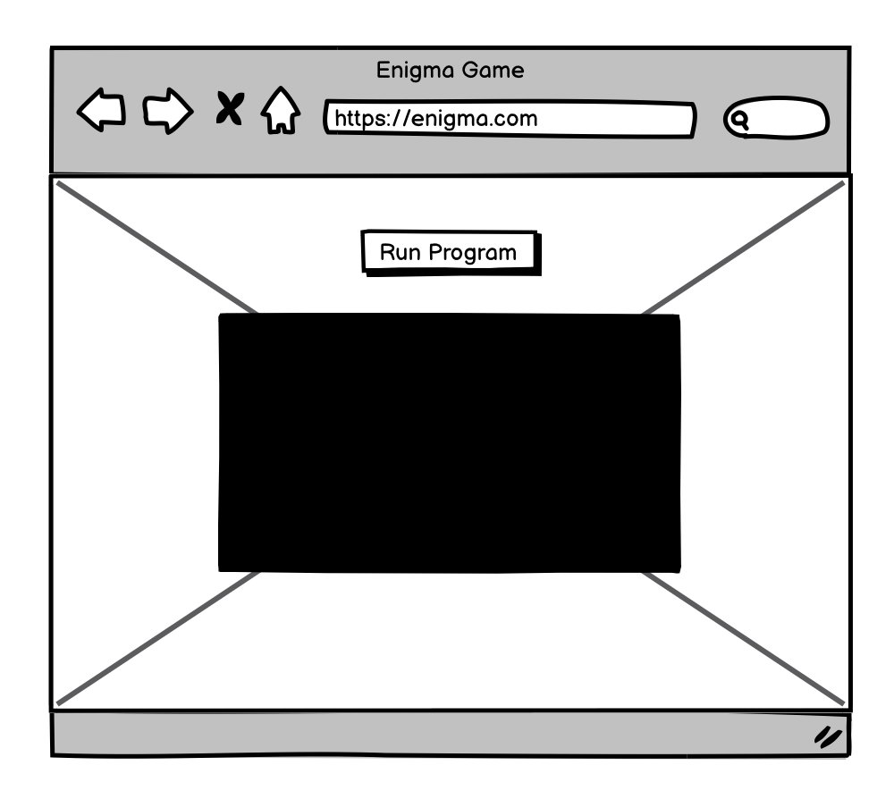
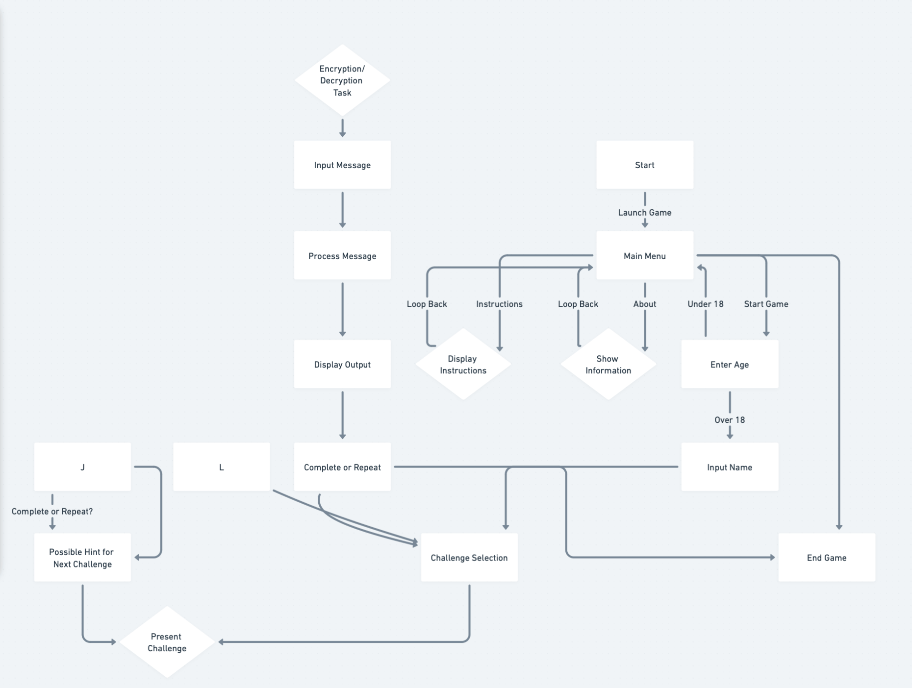
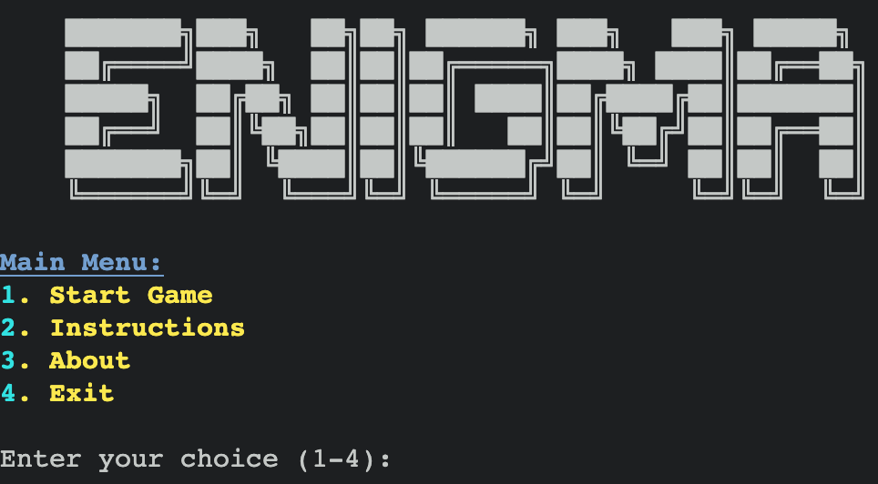
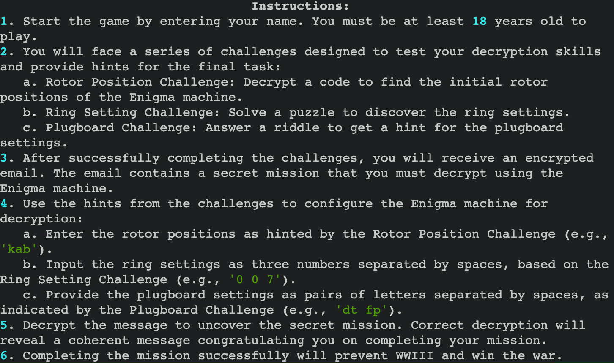
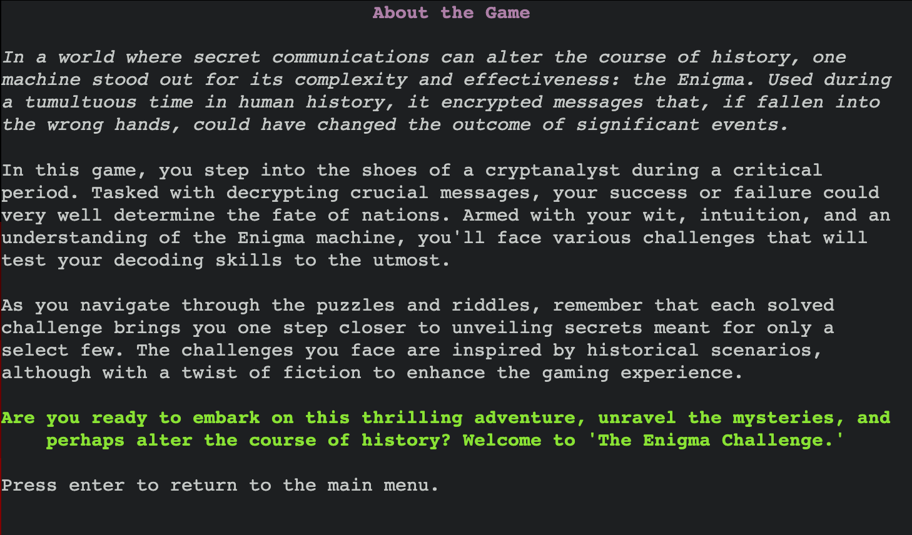

<h1 align="center">Engima</h1>

<h3 align="center"><a href="https://engima-machine-86a7a1dfa74a.herokuapp.com/">➡️ View the live project here ⬅️</a></h3>

 

## Introduction

"Enigma" is a thrilling game that casts you as a cryptanalyst diving into the world of historical cryptography with the Enigma machine. Your mission is to decode messages and solve puzzles, drawing on history and strategy. It's an engaging blend of logic, deduction, and historical intrigue, where each solved puzzle brings you closer to averting a global crisis. Embark on this captivating journey where your wit can change history. Welcome to "Enigma."

 

## Table of Contents

- [Introduction](#introduction)
- [Table of Contents](#table-of-contents)
- [User Experience (UX)](#user-experience--ux-)
  * [User Stories](#user-stories)
    + [User goals](#user-goals)
    + [Company goals](#company-goals)
- [Design](#design)
  * [Typography](#typography)
  * [Color Scheme](#color-scheme)
  * [Wireframes](#wireframes)
  * [Flowchart](#flowchart)
- [Features](#features)
  * [Menu](#menu)
  * [Instructions](#instructions)
  * [About](#about)
  * [Exit](#exit)
  * [Age Verification](#age-verification)
  * [User Name Input](#user-name-input)
  * [Challenges](#challenges)
  * [Historical Missions](#historical-missions)
    + [Rotor Position Challenge](#rotor-position-challenge)
    + [Ring Setting Challenge](#ring-setting-challenge)
    + [Plugboard Setting Challenge](#plugboard-setting-challenge)
  * [Encryption](#encryption)
  * [Email Decryption](#email-decryption)
  * [Time Tracking](#time-tracking)
  * [Future Implementations](#future-implementations)
    + [Additional Levels and Difficulty Settings](#additional-levels-and-difficulty-settings)
    + [Enhanced User Interface](#enhanced-user-interface)
    + [Multiplayer Mode](#multiplayer-mode)
    + [Learning Mode](#learning-mode)
    + [Mobile Compatibility](#mobile-compatibility)
  * [Programming Languages](#programming-languages)
  * [Applications, Plugins & Tools Used](#applications--plugins---tools-used)
- [Deployment & Local Development](#deployment---local-development)
  * [Deployment](#deployment)
  * [Local Development](#local-development)
    + [How to Fork](#how-to-fork)
    + [How to Clone](#how-to-clone)
    + [Committing and Pushing Changes](#committing-and-pushing-changes)
- [Testing](#testing)
  * [Automated Testing](#automated-testing)
    + [Validator Testing](#validator-testing)
      - [HTML Validation](#html-validation)
      - [CSS Validation](#css-validation)
      - [PEP8 Validation](#pep8-validation)
  * [Manual testing](#manual-testing)
    + [User Stories Testing](#user-stories-testing)
    + [Feature Testing](#feature-testing)
    + [Error Handling Testing](#error-handling-testing)
  * [Bugs](#bugs)
    + [Known Bugs](#known-bugs)
    + [Solved Bugs](#solved-bugs)
- [Credits](#credits)
  * [Content](#content)
    + [External Articles and Guides](#external-articles-and-guides)
    + [Community Contributions and Forums](#community-contributions-and-forums)
    + [Design and Spacing Techniques](#design-and-spacing-techniques)
  * [Software Design Documentation](#software-design-documentation)
  * [Media](#media)
  * [Acknowledgments](#acknowledgments)

[Generate TOC](https://ecotrust-canada.github.io/markdown-toc/)

 

## User Experience (UX)

The UX design of "Enigma" focuses on engaging and intuitive gameplay, drawing players into the cryptic world of wartime codebreaking.

### User Stories

#### User goals

- Engaging Challenges: Players seek a game that tests their problem-solving skills in a fun and riddle context.
- Learn through Play: Users are interested in the Enigma machine's history and its role in cryptography.
- Ease of Use: The game should offer a straightforward and intuitive interface suitable for various devices.
- Progress Indicators: Players prefer clear feedback on their performance and progress within the game.

#### Company goals

- Educate and Entertain: The game aims to blend riddles insights with engaging gameplay to keep users entertained.
- Broad Accessibility: Ensuring the game is playable across different platforms to accommodate a wide user base.
- Build a Community: Creating a space for players to connect, share experiences, and learn from each other.
- Iterative Development: Using player feedback to refine the game and introduce new content over time.

## Design

### Typography

Choose fonts that reflect the Enigma machine's era and functionality. Consider using a monospaced font like "Courier" for simulating outputs and a readable font like "Roboto" for instructions and user interfaces.

### Color Scheme

The color palette is pivotal in creating an engaging user experience, drawing inspiration from the era of espionage and secret communications:

- Primary Text Color: A crisp off-white or cream color for main text provides excellent readability against darker backgrounds and minimizes eye strain during prolonged interactions.
- Secondary Text Color: Soft gray for secondary information or hints, ensuring they are distinguishable but not overpowering.
- Highlight and Interactive Elements: A muted gold or brass color an highlight interactive elements, user inputs, or key information, subtly nodding to the metallic elements of historical machinery.
- Error and Alert Messages: A muted red for errors or critical alerts draws attention without clashing with the overall aesthetic.

This design strategy aims to merge the thematic elements of your project with contemporary design principles, ensuring a user-friendly and immersive experience.

### Wireframes

Wireframes are crucial in planning the layout and user flow of the "Enigma" game. They provide a visual representation of the game's structure, ensuring that all elements are logically arranged and accessible to the user. 

### Flowchart

A flowchart provides a visual representation of the game's logic and user interaction flow. Below is the flowchart for the "Enigma" game, illustrating the sequential steps a player takes from the main menu through various game sections, challenges, and eventual completion or exit of the game.

Flowchart Overview:

1. Start: The player begins at the Main Menu, where they can choose to start the game, view instructions, learn about the Enigma machine in the About section, or exit the game.

2. Instructions: If the player selects Instructions, they are taken to a page detailing how to play the game and use the Enigma machine simulator. After reading, they can return to the Main Menu.

3. About: Selecting About takes the player to a page with historical information about the Enigma machine. They can return to the Main Menu after reading.

4. Start Game: Choosing to start the game initiates the Challenges section.

5. Challenges: The player faces a series of decryption challenges. Each challenge must be completed to unlock the next one. The challenges simulate the process of decoding messages using the Enigma machine.

6. Encryption/Decryption Simulator: Alongside or after completing the challenges, players can access the simulator to practice encrypting and decrypting messages with customizable Enigma machine settings.

7. Completion: Upon completing all challenges, the player is congratulated and can choose to explore more features, such as the Encryption/Decryption Simulator, or return to the Main Menu.

8. Exit: At any point, the player can choose to exit the game from the Main Menu or via an in-game option.

Flowchart Visualization:

## Features

### Menu

The main menu offers easy navigation to various sections like Instructions, About, Challenges, and Exit

### Instructions

A section providing a step-by-step guide on using the Enigma simulator.

### About

Details the historical background of the Enigma machine and its significance.

### Exit

Allows users to easily exit the program with options.

### Age Verification

A prompt that ensures players meet the minimum age requirement, enhancing responsible gameplay.

### User Name Input

Allows players to enter their names, personalizing the game experience.

### Challenges

Users can engage in various decryption challenges, enhancing their understanding of the Enigma machine.

### Historical Missions

Create missions inspired by real historical events involving the Enigma machine to add educational value.

#### Rotor Position Challenge

Players decrypt a code to discover the initial settings of the Enigma machine's rotors, simulating the task of historical codebreakers.

#### Ring Setting Challenge

Involves solving riddles or puzzles to deduce the Enigma machine's ring settings, adding depth to the decryption tasks.

#### Plugboard Setting Challenge

Players answer thematic riddles to gain insights into the correct plugboard configurations, further immersing them in the role of a cryptanalyst.

### Encryption

The simulator enables users to encrypt and decrypt messages, experimenting with different machine settings.

### Email Decryption

A feature where players receive an encrypted email within the game, which they must decrypt using the hints obtained from challenges, tying together the skills practiced in previous tasks.

### Time Tracking

The game tracks the time taken to complete challenges, adding a competitive element and encouraging players to improve their decryption speed.

### Future Implementations

#### Additional Levels and Difficulty Settings

Introduce a variety of difficulty levels to cater to both novices and experts, enhancing the game's replayability.

#### Enhanced User Interface

Upgrade the user interface for more intuitive interactions and visual appeal, making the game more engaging.

#### Multiplayer Mode

Add a competitive multiplayer mode, allowing players to challenge others in code-breaking duels.

#### Learning Mode

Implement a mode focused on teaching the principles of cryptography and the history of the Enigma machine.

#### Mobile Compatibility

Ensure the game is optimized for mobile devices, allowing players to enjoy the game on various platforms.

### Programming Languages

- [Python](<https://en.wikipedia.org/wiki/Python_(programming_language)>)
- [HTML5](https://en.wikipedia.org/wiki/HTML5)
- [CSS3](https://en.wikipedia.org/wiki/CSS)
- [JavaScript](https://en.wikipedia.org/wiki/JavaScript)

### Applications, Plugins & Tools Used

[Gitpod](https://www.gitpod.io): Cloud-based IDE for consistent development environments.

[Github](https://github.com/): Platform for version control and collaboration.

[Tiny](https://tinypng.com/): Service for compressing images to improve load times.

[Git](https://git-scm.com/): Distributed version control system for project management.

[ChatGPT](https://chat.openai.com/auth/login): AI tool for content generation and coding assistance.

[Am I Responsive](https://ui.dev/amiresponsive): A tool that allows you to check how your website looks on different devices, ensuring that your web design is responsive.

[Preview](https://support.apple.com/de-de/guide/preview/welcome/mac): macOS app for viewing and editing documents.

[Slack](https://slack.com): A messaging app for teams that brings all communication together, making it easier to stay productive and keep in touch with your team.

[Google Chrome](https://www.google.com/): A fast, secure, and free web browser, built for the modern web, providing powerful development tools for web developers.

[Balsamiq](https://balsamiq.com): A rapid wireframing tool that helps you work faster and smarter, providing a quick way to sketch out user interfaces for websites and applications.

[Python Tutor](https://pythontutor.com/javascript.html#mode=edit): An educational tool that provides a visual step-through of Python code execution, helping beginners understand how their code works under the hood.

[Heroku](https://dashboard.heroku.com/login): Cloud platform for deploying and managing applications.

[PEP](https://pep8ci.herokuapp.com/): Tool for checking Python code against PEP 8 standards.

[Toppr](https://www.toppr.com/ask/): An educational platform that offers a wide range of learning resources, including articles, questions, and answers across various subjects, which was instrumental in formulating logical and engaging challenges for the game.

## Deployment & Local Development

### Deployment

### Local Development

The site is deployed using Heroku.

To deploy the site using Heroku - [Heroku](https://engima-machine-86a7a1dfa74a.herokuapp.com/)

1. Fork or clone this repository.
2. Create a new Heroku app.
3. Choose a region.
4. Set the buildbacks to Python and NodeJS in that order.
5. In Heroku's settings, add a config var of PORT and set the value to 8000.
6. Link the Heroku app to the Github respository.
7. Click on Deploy.

The site has now been deployed. Please note that this process may take a few minutes before the site goes live.

#### How to Fork

To fork the repository:

1. Log in (or sign up) to GitHub.
2. Go to the repository for this project: [DavidTausend/engima](https://davidtausend.github.io/)
3. Click the "Fork" button in the top right corner.

#### How to Clone

To clone the repository:

1. Log in (or sign up) to GitHub.
2. Go to the repository for this project: [DavidTausend/enigma](https://davidtausend.github.io/)
3. Click on the "Code" button, select whether you would like to clone with HTTPS, SSH, or GitHub CLI, and copy the link shown.
4. Open the terminal in your code editor and change the current working directory to the location you want to use for the cloned directory.
5. Type `git clone` into the terminal and then paste the link you copied in step 3. Press enter.

#### Committing and Pushing Changes

After making changes to your local copy, you can commit and push them to GitHub:

1. Open the terminal in the directory of your cloned repository.
2. Use `git status` to see the changes you've made.
3. Use `git add .` to stage all changes for commit, or `git add <filename>` to stage specific files.
4. Use `git commit -m "Your commit message here"` to commit your changes with a descriptive message.
5. Use `git push origin main` to push your changes to the main branch on GitHub.

## Testing

### Automated Testing

#### Validator Testing

##### HTML Validation

Utilized the W3C Markup Validation Service to verify the structure and syntax of the HTML content. This step helped identify and rectify markup errors or inconsistencies to ensure web standards compliance.

##### CSS Validation

The W3C CSS Validation Service was used to check the styling sheets. This process helped in spotting any CSS issues or deviations from the CSS standards, ensuring the styling is robust and cross-browser compatible.

##### PEP8 Validation

For Python code, PEP8 compliance was ensured using tools like flake8 or pycodestyle. This adherence to the Python community's style guide guarantees that the code is readable, maintainable, and follows the conventions understood by a broad base of Python developers.

### Manual testing

#### User Stories Testing

`User Goals`

| User Goals          | How are they achieved? |
|---------------------|------------------------|
| Engaging Challenges | The game introduces various levels and puzzles, each with unique challenges that test problem-solving skills and adapt to the player's growing capabilities. |
| Learn through Play  | Historical facts and narratives about the Enigma machine and its significance during WWII are woven into the gameplay, providing an educational layer. |
| Ease of Use         | A user-friendly interface, clear instructions, and responsive design ensure accessibility across different devices, providing a seamless gaming experience. |
| Progress Indicators | Real-time feedback and progress tracking mechanisms such as scoreboards, level completion indicators, and achievement unlocks motivate players and highlight their advancement. |

`Company Goals`

| Company Goals      | How are they achieved? |
|--------------------|------------------------|
| Educate and Entertain | The game blends historical education with engaging puzzles, appealing to users interested in history and cryptography while ensuring they're entertained. |
| Broad Accessibility | The game is designed to be cross-platform, ensuring users can access it on their preferred devices, enhancing user reach and engagement. |
| Community Building | Features like leaderboards, user forums, or social media integration encourage community interaction, sharing of strategies, and user retention. |
| Iterative Development | Continuous monitoring of user feedback and gameplay data to introduce new content, features, and improvements, ensuring the game remains relevant and enjoyable. |

#### Feature Testing

| Feature                  | Expected Outcome                                                             | Testing Performed                                 | Result                                           | Pass/Fail  |
|--------------------------|------------------------------------------------------------------------------|---------------------------------------------------|--------------------------------------------------|------------|
| Menu                     | Players can navigate through different options easily.                       | Navigate through each option in the main menu.    | All menu options work correctly and are intuitive. | Pass ✅    |
| Instructions             | Players receive clear guidance on how to play the game.                      | View the instructions from the menu.              | Instructions are detailed and easy to understand.  | Pass ✅    |
| About                    | Provide historical context and game background.                              | Access 'About' section from the menu.             | Contains informative content about the Enigma machine. | Pass ✅ |
| Exit                     | Players can exit the game smoothly.                                          | Select 'Exit' from the main menu.                 | Game closes without issues.                         | Pass ✅    |
| Age Verification         | Only players above a certain age can play.                                   | Input ages both above and below the threshold.    | Blocks underage players; allows others.            | Pass ✅    |
| User Name Input          | Players can enter a username for a personalized experience.                  | Enter various usernames.                          | Accepts valid usernames; rejects invalid ones.     | Pass ✅    |
| Rotor Position Challenge | Players must decrypt a message to find initial rotor positions.              | Attempt to solve the rotor position challenge.    | Challenge is solvable; provides correct rotor positions. | Pass ✅ |
| Ring Setting Challenge   | Players solve a puzzle to find ring settings for decryption.                 | Attempt the ring setting challenge.               | Solvable with correct ring settings provided.      | Pass ✅    |
| Plugboard Challenge      | Players must solve a riddle for plugboard settings.                          | Solve the plugboard challenge.                    | Correct plugboard settings are identifiable.       | Pass ✅    |
| Encryption               | Players can encrypt and decrypt messages using Enigma settings.              | Encrypt and decrypt messages.                     | Accurate encryption and decryption of messages.    | Pass ✅    |
| Email Decryption         | Players use hints to decrypt an email containing a secret mission.           | Use given hints to decrypt an email.              | Email is decrypted successfully, revealing the mission. | Pass ✅ |
| Time Tracking            | Game tracks the total time taken for challenges and displays it at the end. | Complete all challenges and observe the total time. | Time is accurately recorded and displayed.        | Pass ✅    |

#### Error Handling Testing

| Error Scenario                     | Expected Outcome                                                         | Testing Performed                                                  | Result                                            | Pass/Fail  |
|------------------------------------|--------------------------------------------------------------------------|--------------------------------------------------------------------|---------------------------------------------------|------------|
| Invalid age input                  | Game prevents progress and prompts for correct age input.                | Enter non-numeric and underage values for age.                     | Non-numeric/underage inputs are rejected with a prompt for re-entry. | Pass ✅    |
| Invalid username input             | Game requests a valid username, only accepting alphabetical characters. | Enter usernames with numbers and special characters.               | Invalid usernames are rejected with a request for a valid one.    | Pass ✅    |
| Incorrect answers in challenges    | Game allows limited attempts and provides hints.                        | Provide incorrect answers to challenges.                           | Incorrect attempts are counted, and hints are provided after failures. | Pass ✅    |
| Navigation to non-existent menu option | Game remains in the current state, showing an error message.           | Try to select an option outside the available menu range.          | Error message displayed, and the game does not crash.             | Pass ✅    |
| Interruption during gameplay       | Game handles unexpected exits gracefully.                               | Close the game window or terminal abruptly.                        | Game closes without corrupting data or causing errors.             | Pass ✅    |
| Encryption/Decryption with incorrect settings | The game informs the player of incorrect settings.                   | Try to encrypt/decrypt with wrong Enigma settings.                 | Game notifies the player about the incorrect settings and does not proceed. | Pass ✅    |
| Overflow in challenge time tracking | The game continues to track time without overflow errors.             | Engage in a challenge for an extended period.                       | Time tracking continues accurately without causing overflow errors. | Pass ✅    |

 

### Bugs

#### Known Bugs

| Bug Description                              | Impact                                                     | Status    |
|----------------------------------------------|------------------------------------------------------------|-----------|
| Delay in loading the game on older hardware. | May cause a slight delay in starting the game for some users on older systems. | Identified, optimization planned for future updates. |
| Visual glitches in terminal on some OS.      | Minor display issues in certain terminal emulators, not affecting gameplay. | Identified, under investigation for a workaround. |

#### Solved Bugs

| Bug Description                              | Solution Implemented                                       | Result    |
|----------------------------------------------|------------------------------------------------------------|-----------|
| User input not properly validated in some cases. | Enhanced input validation checks across the game.         | User inputs are now robustly validated, preventing unexpected behavior. |
| Game crash when entering extremely long usernames. | Set a character limit for username input.                  | Prevents game crashes by restricting the username length. |
| Incorrect rotor positions causing decryption errors. | Implemented additional hints and feedback for incorrect settings. | Players now receive clearer guidance, reducing decryption errors. |
| Plugboard settings not recognized in certain formats. | Standardized plugboard input format and added user guidance. | Consistency in plugboard settings input, improving user experience. |

## Credits

### Content

#### External Articles and Guides

- Insight into the Enigma machine's mechanics and history was primarily drawn from Wikipedia's comprehensive article, youtube, providing an authentic backdrop for the game's narrative and challenges.

- Advanced object-oriented programming concepts were reinforced through Real Python tutorials, which aided in structuring the game's code effectively.

#### Community Contributions and Forums

- The supportive community at Code Institute offered advice, code reviews, and motivation.

- Various threads on Stack Overflow were instrumental in overcoming specific coding challenges and debugging.

#### Design and Spacing Techniques

- The game's user interface design was influenced by terminal-based games from the 1980s, with modern touches for readability and user experience, inspired by articles on Smashing Magazine.

### Software Design Documentation

- Initial planning and documentation were supported by Lucidchart, which was used to create UML diagrams and flowcharts, mapping out the game's architecture and logic flow.

### Media

- Enigma Machine Images: Historical images of the Enigma machine, used in the README and the game's introduction, were sourced from public domain collections to maintain historical accuracy and enhance immersion.

### Acknowledgments

- Mentor Support: Immense gratitude to my mentor, Matt Bordden, for their guidance, insightful feedback, and encouragement throughout the development process.

- Peer Feedback: Thanks to fellow Code Institute students who provided valuable feedback and suggestions during project development.

- Family and Friends: A special thank you to my family and friends for their patience, support, and testing assistance, contributing to the refinement of the game's user experience.

[Back to Top ^](#introduction)

pip3 freeze > requirements.txt